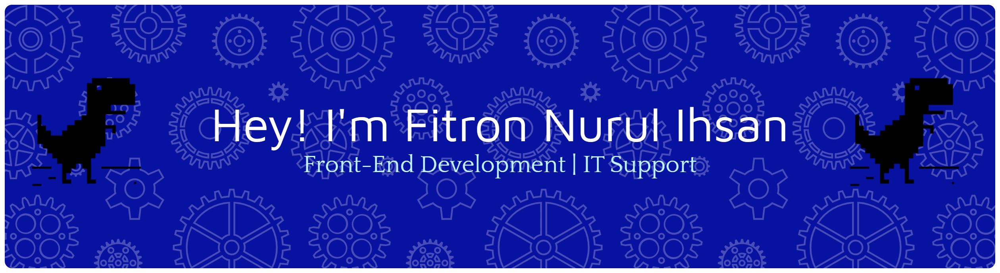

- # Hi there 👋, I'm Fitron Nurul Ihsan
  

**Frontend Web Developer & IT Support Enthusiast**

##### About Me

- 🎓Bachelor's Degree in Computer Science - Universitas Bina Sarana Informatika
- 🌱 Currently learning JavaScript and Web Development
- 💻 Interested in Front-End Development and IT Support
- 📍 Lampung, Indonesia

##### Skills

- 
- 
- 
- 
- 
- 
- 
- 
- 
- 
- Basic Networking
- IT Support

##### Current Goals

- Complete Dicoding Front-End Developer learning path
- Build portfolio projects
- Improve JavaScript skills
- 🌱 Currently learning JavaScript and Web Development
- 💻 Interested in Front-End Development and IT Support
- 📍 Lampung, Indonesia

##### Connect with me

